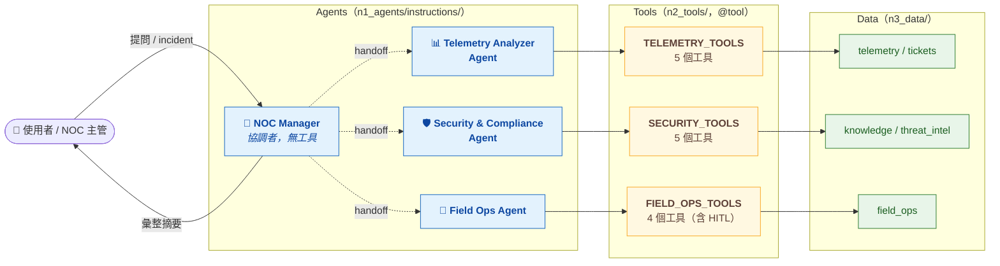

# NOA Multi-Agent Workshop

> 我們把 Microsoft NOA 簡化成 **4 個專業 agent x 3 種 orchestration 模式**，做一套擬真電信網路 incident 的 multi-agent 系統。
> 並透過 **3 個網路維運場景 x 10 個擬真資料集**，學習 Micrososft NOA 的核心精神。
> 最後把整個 multi-agent 系統的執行環境 host 在 **Microsoft Foundry** 服務中，並發布至 **Microsoft Teams** 頻道，以協助一般使用者解決網路維運相關的技術問題。

---

## 📖 目錄

- [學習重點](#學習重點)
- [前置需求](#前置需求)
- [5 分鐘快速體驗](#5-分鐘快速體驗)
- [概念地圖](#概念地圖)
  - [NOA → Workshop 對照](#noa--workshop-對照)
  - [4 個 agent 的 RACI](#4-個-agent-的-raci)
  - [Agents ↔ Tools ↔ Data](#agents--tools--data)
  - [從屬關係 cheat sheet](#從屬關係-cheat-sheet)
- [三種 Orchestration 模式](#三種-orchestration-模式)
- [兩個情境](#兩個情境)
- [專案結構](#專案結構)
- [動手做：5 步驟跑完整個 workshop](#動手做5-步驟跑完整個-workshop)
  - [Step 1 — 在 Foundry portal 建 4 個 Prompt Agent](#step-1--在-foundry-portal-建-4-個-prompt-agent)
  - [Step 2 — 啟動 DevUI](#step-2--啟動-devui)
  - [Step 3 — 在 Agent 類別與 7 個 agent 互動](#step-3--在-agent-類別與-7-個-agent-互動)
  - [Step 4 — 在 Workflow 類別觀察 graph 與 HITL](#step-4--在-workflow-類別觀察-graph-與-hitl)
  - [Step 5 — 部署成 Foundry hosted agent](#step-5--部署成-foundry-hosted-agent)
- [雙模式設計（local vs. hosted）](#雙模式設計local-vs-hosted)
- [CLI 速查](#cli-速查)
- [常見錯誤](#常見錯誤)
- [延伸主題](#延伸主題)
- [參考資料](#參考資料)

---

## 學習重點

| 主題                  | 內容                                                                                       |
| --------------------- | ------------------------------------------------------------------------------------------ |
| **Agent 設計**        | 4 個 agent 的 system prompt 拆分原則：NOC Manager + Telemetry / Security / Field Ops       |
| **Tool 設計**         | 各 agent 用 Python `@tool` 綁定的工具集（含 HITL `approval_mode="always_require"`）        |
| **Orchestration**     | Sequential / Handoff / Magentic 三種多 agent 協作模式對比                                  |
| **DevUI**             | 用 `agent_framework.devui` 在瀏覽器互動觀察 agent 與 workflow                              |
| **Foundry portal**    | 在 Foundry portal 建立 4 個 Prompt Agent，切換到 hosted 模式                               |
| **Hosted Agent 部署** | 把 Handoff multi-agent 包成容器，用 `AIProjectClient.agents.create_version` 部署到 Foundry |

> 提供 **擬真電信資料集**（KPI 時序、告警、topology、SOP、ticket、IOC、技師排班）。
> 模擬 NOA 架構如何處理「**光纖中斷**」與「**安全事件**」的 multi-agent 系統。

---

## 前置需求

1. **Python 3.10+**（建議 3.11）與 [`uv`](https://docs.astral.sh/uv/)
2. **Azure CLI** 並登入：`az login`
3. **Microsoft Foundry project**，內含一個已部署的 chat 模型（建議 `gpt-4o`）
4. **Docker / Azure CLI ACR 擴充**（只有 Step 5 部署 hosted agent 需要）

---

## 5 分鐘快速體驗

跑這四步，你會得到一個能呼叫工具、回應 KPI 異常的 telemetry agent，代表整個環境就緒。

```bash
# 1. 進入專案資料夾並安裝相依套件
cd noa-workshop
uv sync

# 2. 複製並編輯環境變數
cp .env.example .env
# 編輯 .env：填入 FOUNDRY_PROJECT_ENDPOINT 與 AZURE_AI_MODEL_DEPLOYMENT_NAME

# 3. 確認 Azure CLI 已登入
az login
az account show

# 4. 跑 smoke test：驗證 endpoint 通路 + 第一個 agent + tool 能跑
uv run python -m noa_workshop.smoke_test
```

`smoke_test.py` 會建一個綁了 `query_kpi_metrics` 的 telemetry agent，問它「north-transport-ring 過去 30 分鐘的 packet_loss_pct 是不是異常？」，看到表格化回覆代表全部就緒。

---

## 概念地圖

### Agents ↔ Tools ↔ Data 三層結構

下圖只給三層結構的鳥瞰；每個 agent 對應的工具與資料檔的詳細名稱，請看下方 [4 個 agent 的角色設定](#4-個-agent-的角色設定)。



### 4 個 agent 的角色設定

|      | **NOC Manager**                            | **Telemetry Analyzer<br/>Agent**                                           | **Security & Compliance<br/>Agent**                                                                         | **Field Ops<br/>Agent**                                                       |
| ---- | ------------------------------------------ | -------------------------------------------------------------------------- | ----------------------------------------------------------------------------------------------------------- | ----------------------------------------------------------------------------- |
| 角色 | **NOC 的協調者**。                         | **網路遙測分析師**。                                                       | **網路安全與合規驗證員**。                                                                                  | **現場維運協調員**。                                                          |
| 指令 | `noc_manager.md`                           | `telemetry_analyzer.md`                                                    | `security_compliance.md`                                                                                    | `field_ops.md`                                                                |
| 工具 | _(無 — 純協調，把任務 handoff 給三位專家)_ | `TELEMETRY_TOOLS`<br/>(`telemetry_tools.py`)                               | `SECURITY_TOOLS`<br/>(`security_tools.py`)                                                                  | `FIELD_OPS_TOOLS`<br/>(`field_ops_tools.py`)                                  |
| 資料 | _(無)_                                     | `n3_data/telemetry/*.json`、<br/>`n3_data/tickets/historical_tickets.json` | `n3_data/threat_intel/ioc_feed.json`、<br/>`n3_data/knowledge/*`、<br/>`n3_data/telemetry/kpi_metrics.json` | `n3_data/field_ops/technicians.json`、<br/>`n3_data/field_ops/inventory.json` |

### 4 個 agent 的 RACI

| 動作           | NOC Manager | Telemetry | Security | Field Ops        |
| -------------- | ----------- | --------- | -------- | ---------------- |
| 接收使用者問題 | **R/A**     | I         | I        | I                |
| 查 KPI / 告警  | C           | **R/A**   | I        | I                |
| IOC / 策略判斷 | C           | I         | **R/A**  | I                |
| 派工 / 通知    | A           | I         | I        | **R**（需 HITL） |
| 對主管彙整摘要 | **R/A**     | C         | C        | C                |

> R=Responsible / A=Accountable / C=Consulted / I=Informed

### 10 個擬真資料集

`n3_data/` 下的 10 份檔案，對應到一個典型電信／網路維運中心的資料來源系統與負責部門，剛好覆蓋一次完整的事件處理迴路：**告警 → 佐證 → 定位 → 知識比對 → 派工 → 留檔**。

| 層級             | 檔案                              | 對應 OSS/BSS 模組／來源系統                                                         | 主要負責部門               |
| ---------------- | --------------------------------- | ----------------------------------------------------------------------------------- | -------------------------- |
| **觀測層**       | `alarms.json`、`kpi_metrics.json` | FM（Fault Mgmt）+ PM（Performance Mgmt）／NMS、EMS、Streaming Telemetry、Prometheus | NOC                        |
| **拓撲／資產層** | `topology.json`、`inventory.json` | Inventory／CMDB（Netbox、ServiceNow CMDB）、IP/Optical Planning、WMS                | Network Planning + 倉管    |
| **人力／作業層** | `technicians.json`                | WFM／FSM（ServiceNow FSM、Salesforce FSL）                                          | 區網維運 / 外勤派工中心    |
| **知識／政策層** | `policies.json`、`sop_*.md`       | Policy Engine、Knowledge Base（Confluence、ServiceNow KB）、SLA 管理平台            | NOC + Network Architecture |
| **安全層**       | `ioc_feed.json`                   | TIP（MISP、Anomali、Recorded Future）、SIEM（Splunk、Sentinel）                     | SOC / Threat Intel         |
| **歷史／回饋層** | `historical_tickets.json`         | TTS / ITSM（ServiceNow ITSM、BMC Remedy、TM Forum TMF621）                          | NOC + SRE                  |

> 這套資料切面是訓練多代理（multi-agent）AIOps 系統很標準的素材：每個 agent 對應現實世界的一個專業團隊，每份資料都映射到真實 OSS/BSS 系統的某個模組。

---

## 三種 Orchestration 模式

| 模式           | Builder                                 | 由誰決定下一步                   | NOA 對應                   | 本 Repo 對應檔案                                                                  |
| -------------- | --------------------------------------- | -------------------------------- | -------------------------- | --------------------------------------------------------------------------------- |
| **Sequential** | `SequentialBuilder` / `WorkflowBuilder` | 寫死的 pipeline                  | NOA baseline 簡化          | `n1_agents/orchestration_sequential.py`<br/>`n4_workflows/workflow_sequential.py` |
| **Handoff**    | `HandoffBuilder` / `WorkflowBuilder`    | NOC Manager（LLM 推論）          | NOA Mark-1                 | `n1_agents/orchestration_handoff.py`<br/>`n4_workflows/workflow_handoff.py`       |
| **Magentic**   | `MagenticBuilder`                       | Manager Agent（LLM 推論 + 規劃） | NOA Mark-2 dynamic planner | `n1_agents/orchestration_magentic.py`                                             |

> 同一個情境會用兩種建模法各做一次：
>
> - **`orchestration_*`**（chat 介面）— 用高階 builder 拼裝、`Workflow.as_agent()` 包成 chat-ready agent，DevUI 顯示在 Agent 類別。
> - **`workflow_*`**（graph 介面）— 用 `WorkflowBuilder.add_edge` 顯式畫拓樸，DevUI 顯示在 Workflow 類別、可看到節點與條件邊。
>
> 同樣場景做兩種介面，是為了讓你**對比**「宣告式 orchestration」與「顯式 graph」兩種抽象層的差異。

---

## 兩個情境

| 情境  | 名稱     | 用於                                   | 故事                                                                                                                       |
| ----- | -------- | -------------------------------------- | -------------------------------------------------------------------------------------------------------------------------- |
| **A** | 光纖中斷 | 4 個 single agent、Sequential、Handoff | 北部某傳輸環的 P1 告警，多條鏈路丟包率飆升、延遲倍增。Agent 需查 KPI、判斷拓撲、確認非安全事件、派工修光纖。               |
| **C** | 安全事件 | Magentic                               | 核心網某節點出現異常南向流量，加上可疑 IOC，需釐清是 DDoS、設定漂移、還是內部誤操作。Magentic manager 動態決定要叫誰先查。 |

---

## 專案結構

```
noa-workshop/
├── README.md                       ← 你現在看的這份
├── pyproject.toml                  ← 套件相依
├── .env.example                    ← 環境變數範本
├── Dockerfile                      ← Step 5 hosted-agent 容器
├── agent.manifest.yaml             ← Step 5 azd 部署 manifest
├── src/noa_workshop/
│   ├── smoke_test.py               ← Quick Start: hello agent + 1 tool
│   ├── n1_agents/
│   │   ├── instructions/                ← 4 份繁中 system prompt（markdown）
│   │   ├── agent_factory.py             ← 雙模式 agent factory
│   │   ├── single_agents.py             ← 4 個 single agent + get_all_single_agents()
│   │   ├── orchestration_sequential.py  ← SequentialBuilder
│   │   ├── orchestration_handoff.py     ← HandoffBuilder
│   │   └── orchestration_magentic.py    ← MagenticBuilder（場景 C）
│   ├── n2_tools/
│   │   ├── telemetry_tools.py
│   │   ├── security_tools.py
│   │   ├── field_ops_tools.py      ← 含 HITL approval_mode 與 _AUTO 兩版
│   │   └── data_loader.py          ← data loader、incident memory
│   ├── n3_data/                    ← 8 份擬真 sample data
│   │   ├── telemetry/              ← kpi_metrics / alarms / topology
│   │   ├── tickets/                ← historical_tickets
│   │   ├── knowledge/              ← policies、SOP markdown
│   │   ├── threat_intel/           ← ioc_feed
│   │   └── field_ops/              ← technicians、inventory
│   ├── n4_workflows/
│   │   ├── workflow_sequential.py  ← 顯式 graph (DevUI 可視化)
│   │   └── workflow_handoff.py     ← 顯式 graph + HITL approval
│   ├── n5_devui/
│   │   └── devui_server.py           ← 一次載入 9 個 entity 的 DevUI launcher
│   └── n6_deployment/
│       ├── hosted_agent.py           ← ResponsesHostServer（Step 5 容器入口）
│       └── hosted_agent_deployer.py  ← build + push + create_version 腳本
└── uv.lock
```

---

## 動手做：5 步驟跑完整個 workshop

下面 5 步是 **workshop 學員的主要動線**：Step 1 在 Foundry portal 上手動建 4 個 Prompt Agent；
Step 2–4 全在本機 DevUI 操作；Step 5 把 multi-agent workflow 部署回 Foundry。

### Step 1 — 在 Foundry portal 建 4 個 Prompt Agent

> 這一步讓你在 portal 把每個 agent「看到」一次，理解什麼是「server-managed agent」。
> 建好後同一份 workshop 程式可切到 hosted 模式（`NOA_USE_HOSTED_AGENTS=true`），
> 用同一份 instructions 而完全不改 client 端 code。

#### 為什麼要在 portal 建 agent？

1. **看見**：在 portal 把每個 agent「看到」一次，理解「server-managed agent」的概念。
2. **未來把更多動作搬上雲**：portal 的 Prompt Agent 可以直接掛 OpenAPI、知識庫、code interpreter，不用寫 Python。
3. **驗證 endpoint 通路**：完成 portal → SDK 的連通流程，往後做 production agent 都會用到。

#### 一步一步來（每個 agent 重複 4 次）

1. 進 [Foundry portal](https://ai.azure.com/) → 你的 project → 左側 **Agents**。
2. 按 **+ New agent**，type 選 **Prompt Agent**。
3. **Name** 欄填下表對應名稱（要跟 `.env` 對齊）。
4. **Model deployment** 選你 project 內的 chat model（建議 `gpt-4o`）。
5. **Instructions** 欄打開 [`src/noa_workshop/n1_agents/instructions/`](noa-workshop/src/noa_workshop/n1_agents/instructions/) 內對應的 markdown，全選整段貼進去。
6. **Tools** 欄留空（本 workshop 的 tool 由 Python 端注入；portal 不需要設）。
7. 按 **Create**。

| 順序 | Portal Agent Name     | 對應 instructions 檔     | `.env` 變數                  |
| ---- | --------------------- | ------------------------ | ---------------------------- |
| 1    | `noc-manager`         | `noc_manager.md`         | `NOA_NOC_MANAGER_AGENT_NAME` |
| 2    | `telemetry-analyzer`  | `telemetry_analyzer.md`  | `NOA_TELEMETRY_AGENT_NAME`   |
| 3    | `security-compliance` | `security_compliance.md` | `NOA_SECURITY_AGENT_NAME`    |
| 4    | `field-ops`           | `field_ops.md`           | `NOA_FIELD_OPS_AGENT_NAME`   |

#### 切換 SDK 到 hosted 模式（選用，本 workshop Step 2–4 不需要切）

```bash
# 在 .env 內把這行改成 true
NOA_USE_HOSTED_AGENTS=true
```

`agent_factory.py` 偵測到 `NOA_USE_HOSTED_AGENTS=true` 就會用 `FoundryAgent` 連到 portal 上你建好的 agent，
而不是用 markdown + Python tool 在本地組裝。

#### Hosted 模式注意事項

- **Hosted 模式下，Python `@tool` 不會被 portal agent 自動使用。** Portal agent 只看自己的 instructions。
- 因此 hosted 模式比較適合用來示範「endpoint 真的通」。完整的 tool-driven 體驗請留在 local 模式。
- DevUI 的 `Workflow_Handoff` 用了 structured-output（`response_format=RoutingPlan`），目前**只支援 local 模式**，請不要在 hosted 模式下跑它。

### Step 2 — 啟動 DevUI

DevUI 是 Microsoft Agent Framework 內建的本機除錯介面，在瀏覽器看每個 agent / workflow 的執行軌跡、訊息流、節點圖。

```bash
cd noa-workshop
uv run python -m noa_workshop.n5_devui.devui_server
```

啟動後在瀏覽器開 **<http://localhost:8080>**。

> ⚠️ 一定要打 `localhost`，不是 `127.0.0.1`。DevUI 前端 bundle 的 fetch origin hardcode 了 `localhost:8080`，
> 用 IP 會吃 CORS。

啟動成功後左側 Entities 清單會看到 **9 個 entity**：

| 類別     | 名稱                       | 來源                                                                        |
| -------- | -------------------------- | --------------------------------------------------------------------------- |
| Agent    | `NOCManager`               | `n1_agents/single_agents.py`                                                |
| Agent    | `TelemetryAnalyzer`        | `n1_agents/single_agents.py`                                                |
| Agent    | `SecurityCompliance`       | `n1_agents/single_agents.py`                                                |
| Agent    | `FieldOps`                 | `n1_agents/single_agents.py`                                                |
| Agent    | `Orchestration_Sequential` | `n1_agents/orchestration_sequential.py`（`SequentialBuilder` → `as_agent`） |
| Agent    | `Orchestration_Handoff`    | `n1_agents/orchestration_handoff.py`（`HandoffBuilder` → `as_agent`）       |
| Agent    | `Orchestration_Magentic`   | `n1_agents/orchestration_magentic.py`（`MagenticBuilder` → `as_agent`）     |
| Workflow | `Workflow_Sequential`      | `n4_workflows/workflow_sequential.py`（顯式 `add_edge` graph）              |
| Workflow | `Workflow_Handoff`         | `n4_workflows/workflow_handoff.py`（顯式 graph + HITL approval）            |

### Step 3 — 在 DevUI Agent 類別與 7 個 agent 互動

從 DevUI Entities 清單選下面任何一個 agent，輸入訊息開始對話。

#### 先試 4 個 single agent（理解每個 agent 的 RACI）

| Agent                | 試試這樣問                                                                       |
| -------------------- | -------------------------------------------------------------------------------- |
| `NOCManager`         | 「north-transport-ring 出現 P1，請幫我規劃處理流程」（純協調，不會自己查資料）   |
| `TelemetryAnalyzer`  | 「north-transport-ring 區域過去 30 分鐘 packet_loss_pct 跟 baseline 比怎麼樣？」 |
| `SecurityCompliance` | 「14:10 出現的 SIG-BOT-2104 簽章是什麼來頭？」                                   |
| `FieldOps`           | 「north-transport-ring 附近有沒有可派的光纖技師？」                              |

#### 再試 3 個 multi-agent（觀察協作）

| 模式                       | 試試這樣問                                                                                      |
| -------------------------- | ----------------------------------------------------------------------------------------------- |
| `Orchestration_Sequential` | 「north-transport-ring 出現 P1 告警，請依序確認 KPI、判斷是否安全事件、需要派工就草擬派工建議」 |
| `Orchestration_Handoff`    | 同上。NOC Manager 會挑要呼叫哪些專家，跑完才總結                                                |
| `Orchestration_Magentic`   | 切換到場景 C：「CORE-POP1-EDGE 14:10 出現異常南向流量 + SIG-BOT-2104，這是不是安全事件？」      |

> 在 DevUI 內可以同時開多個分頁分別跟 4 個 single agent 對話，自己手動模擬一輪 multi-agent 協作，
> 然後再開 `Orchestration_Sequential` / `Orchestration_Handoff` 看 framework 怎麼幫你串起來——這對理解 orchestration 的價值很有感。

### Step 4 — 在 Workflow 類別觀察 graph 與 HITL

DevUI Workflow 類別與 Agent 類別最大的差別：**會畫出 workflow 的 graph 拓樸**，可以一邊跑、一邊看訊息在哪個 executor、走哪條 edge。

| Workflow              | 觀察重點                                                                                                                                                                                    |
| --------------------- | ------------------------------------------------------------------------------------------------------------------------------------------------------------------------------------------- |
| `Workflow_Sequential` | Telemetry → Security → FieldOps 線性管線；當 Security 判定「是安全事件」時走 escalation 分支終止，否則才走到 FieldOps。觀察條件 edge 的綠 / 紅顏色                                          |
| `Workflow_Handoff`    | NOC Manager 一次性 routing → 條件式 fan-out / fan-in；**最重要的是 HITL 審批**：FieldOps 呼叫 `create_dispatch_request` 時 workflow 會凍結，DevUI 跳出 approval 提示，按 **Approve** 才繼續 |

> 💡 HITL 是**安全網**而非阻礙。只在「不可逆的真實世界動作」上加 approval（派工、出單、寫資料庫）。
> 如要看 NOC manager 在被拒絕後會怎麼回，按 **Reject** 觀察它怎麼放棄派工、改寫摘要。

### Step 5 — 部署成 Foundry hosted agent

> 把 Step 3 / Step 4 玩過的 `Orchestration_Handoff` 包成容器，用 Foundry hosted agent 部署到雲上，
> 之後外部 app 就能用標準 OpenAI Responses 協定打它。

部署的三個關鍵檔：

| 檔案                                                                                                                              | 角色                                                                             |
| --------------------------------------------------------------------------------------------------------------------------------- | -------------------------------------------------------------------------------- |
| [`Dockerfile`](noa-workshop/Dockerfile)                                                                                           | 把 workshop 包成 `linux/amd64` 容器，`CMD` 啟動 `hosted_agent`                   |
| [`agent.manifest.yaml`](noa-workshop/agent.manifest.yaml)                                                                         | `azd` / Foundry hosted-agent 部署清單，宣告 entrypoint 與環境變數                |
| [`src/noa_workshop/n6_deployment/hosted_agent_deployer.py`](noa-workshop/src/noa_workshop/n6_deployment/hosted_agent_deployer.py) | 一行命令完成「build → ACR push → `create_version` → 等到 `active` → smoke test」 |

#### 一鍵部署

```bash
cd noa-workshop
uv run python -m noa_workshop.n6_deployment.hosted_agent_deployer
```

腳本會做這些事（依序）：

1. `az acr build`（cloud-side build）把 image 推到 Foundry 配對的 ACR
2. `AIProjectClient.agents.create_version(...)` 註冊一個 hosted agent 版本
3. 輪詢直到 `status == 'active'`
4. 用 `project.get_openai_client(agent_name=...)` 對它呼一次 Responses API 做 smoke test（送 `SCENARIO_A_PROMPT`）

部署成功後，整個 multi-agent Handoff workflow 變成 Foundry 上**一個 hosted agent**，
可以在 portal 直接呼叫，也可以從外部 app 用 OpenAI Responses 協定打。

#### 為什麼選 Handoff 部署而不是 Sequential / Magentic？

- **Sequential**：每次都跑全部 3 個 agent，浪費 token 也不真實。
- **Magentic**：manager 動態規劃，目前 `agent_framework_foundry_hosting` Responses 協定還在 beta，hosted 端對 Magentic 控制流的支援不穩。
- **Handoff**：NOC Manager 一次性 routing，graph 結構穩定、token 用量可控，是目前最適合落地到 hosted agent 的選擇。

#### Hosted 部署上的取捨

部署到 Foundry hosted agent 後，FieldOps 的 `create_dispatch_request` 會換成 `create_dispatch_request_auto`（自動核准）—— 這是 `agent_framework_foundry_hosting` 目前的限制（Responses 協定還不支援 `function_approval_request` 內容）。

完整 HITL 流程在 Step 4 的 `Workflow_Handoff` 內保留教學，所以工作坊主軸不受影響。

---

## 雙模式設計（local vs. hosted）

為了讓學員能「**先跑通本地、再切換 hosted**」，我們把 agent 建立抽象成 factory：

| 模式   | 觸發                                  | 哪裡看 instructions           | 哪裡看 tools                        |
| ------ | ------------------------------------- | ----------------------------- | ----------------------------------- |
| 本地   | `NOA_USE_HOSTED_AGENTS=false`（預設） | `n1_agents/instructions/*.md` | Python `@tool` 函式                 |
| Hosted | `NOA_USE_HOSTED_AGENTS=true`          | Foundry portal                | Python `@tool` 函式（runtime 注入） |

兩種模式共用同一份 workflow / multi-agent code，只差在 [`n1_agents/agent_factory.py`](noa-workshop/src/noa_workshop/n1_agents/agent_factory.py) 的 `make_agent()` 內部實作。

> ⚠️ 常見誤解：Foundry Agent Service 並不是「每個 agent 各自一個 endpoint+key」。實際是這樣：
>
> ```
> 1 個 Foundry project endpoint
>    ├── 1 個 model deployment (gpt-4o)
>    ├── Prompt Agent A (agent_name=noc-manager)
>    ├── Prompt Agent B (agent_name=telemetry-analyzer)
>    ├── Prompt Agent C (agent_name=security-compliance)
>    └── Prompt Agent D (agent_name=field-ops)
> ```
>
> 因此 `.env` 只需要 1 個 `FOUNDRY_PROJECT_ENDPOINT` + 1 個 model deployment + 4 個 agent name。
> 認證走 `az login` + `DefaultAzureCredential`，不需要 API key。

---

## CLI 速查

不想開 DevUI 也可以從 CLI 直接跑。下面每支腳本都帶有 demo prompt，方便你 in-place 觀察輸出。

```bash
# Quick Start: 1 個 agent + 1 個 tool（驗證環境）
uv run python -m noa_workshop.smoke_test

# 3 種 orchestration（CLI 內各自有 demo prompt）
uv run python -m noa_workshop.n1_agents.orchestration_sequential
uv run python -m noa_workshop.n1_agents.orchestration_handoff
uv run python -m noa_workshop.n1_agents.orchestration_magentic

# 2 個 graph workflow（CLI 內含 HITL approval prompt）
uv run python -m noa_workshop.n4_workflows.workflow_sequential
uv run python -m noa_workshop.n4_workflows.workflow_handoff

# Step 5 部署（會啟動 az acr build + create_version）
uv run python -m noa_workshop.n6_deployment.hosted_agent_deployer
```

---

## 常見錯誤

| 症狀                                                                                  | 解法                                                                                                                                                     |
| ------------------------------------------------------------------------------------- | -------------------------------------------------------------------------------------------------------------------------------------------------------- |
| `RuntimeError: Neither FOUNDRY_PROJECT_ENDPOINT nor AZURE_AI_PROJECT_ENDPOINT is set` | 沒複製 `.env.example` 為 `.env`；或 `.env` 沒有被載入。請確認 `cp .env.example .env` 並填好 endpoint                                                     |
| 401 / 403                                                                             | `az login` 沒登入，或登入到錯的 tenant；檢查 `az account show`                                                                                           |
| 404 agent not found（hosted 模式）                                                    | `.env` 內的 agent name 跟 portal 不一致                                                                                                                  |
| 看不到 model deployment                                                               | 確認 project 已部署 `gpt-4o`（Foundry portal → Deployments）                                                                                             |
| DevUI 開啟瀏覽器後 fetch CORS error                                                   | 一定要打 `http://localhost:8080`，不是 `127.0.0.1`。前端 bundle 把 origin hardcode 了                                                                    |
| DevUI agent-mode 點 Approve 後跳 `Object of type Content is not JSON serializable`    | 這是 framework 已知限制。`Orchestration_*` 已經改用 `create_dispatch_request_auto`，請改用 `Workflow_Handoff`（workflow-mode）觀察完整 HITL 流程         |
| `uv sync` 後 `ImportError: cannot import name 'tool' from 'agent_framework'`          | umbrella package 的 `__init__.py` 偶會被裝成 0 byte。修：`uv pip install --force-reinstall --no-deps agent-framework-core==<version>`                    |
| Step 5 部署失敗、container 起不來                                                     | 先在本機跑 `uv run python -m noa_workshop.n6_deployment.hosted_agent` 驗證程式本身能跑；再檢查 ACR 名稱與 `FOUNDRY_PROJECT_ENDPOINT` 是不是同一個 region |

---

## 延伸主題

下面 5 個主題本 workshop 主軸沒展開，但都是把 multi-agent 推上 production 的關鍵。每個主題給一個切入點，做完 5 步後想繼續深入的你可以挑感興趣的往下挖。

### 1. Memory（給 agent 記憶）

NOA Mark-2 用 memory 讓 agent 記得「上一次同個區域出問題的處理經驗」。

```python
from agent_framework.memory import UserMemoryProvider  # 範例 import 路徑

agent = Agent(
    client=shared_chat_client(),
    instructions=...,
    tools=[...],
    context_providers=[UserMemoryProvider(scope="user_id_or_tenant")],
)
```

設計重點：

- Memory 要 scope 到 incident / region / user，不要 global。
- 寫入策略：在 `noc_manager` 結尾把摘要寫回 memory；不要全文 dump。

參考：[Memory & Persistence](https://learn.microsoft.com/agent-framework/get-started/memory)。

### 2. MCP（接 TMF621 / 既有 IT 系統）

電信常用的 ticketing 通常是 TMF621；以 MCP server 包起來，agent 才能跨系統溝通。

```python
from agent_framework import HostedMCPTool

tmf621 = HostedMCPTool(
    name="tmf621_ticketing",
    url="https://your-mcp-server.example.com/mcp",
    approval_mode="always_require",  # 開單視為寫操作 → 走 HITL
    headers={"Authorization": f"Bearer {TOKEN}"},
)
```

把 MCP tool 加到 `field_ops` 的 tools。雷區：Bearer token 不要寫死，請走 Azure Key Vault / Managed Identity。

### 3. Evaluation（離線品質評估）

工作坊只看「跑得起來」，但 production 需要評估。用 [Foundry Evaluations](https://learn.microsoft.com/azure/ai-foundry/concepts/evaluation-approach-gen-ai) 對下面三個指標打分：

1. **Tool selection accuracy**：是否選對工具。
2. **Handoff correctness**：NOC manager 是否 dispatch 給對的 specialist。
3. **Final summary alignment**：摘要是否反映實際 telemetry 結論。

自製 dataset：把 `n3_data/` 內的檔案做成 ground truth，再造 20 條 incident prompt。

### 4. Observability（OpenTelemetry）

把 agent 的「思考過程」變成可追蹤的 trace，是 multi-agent 上 production 的必要工程。Agent Framework 內建 OTel hook：

```python
from opentelemetry import trace
from opentelemetry.exporter.otlp.proto.grpc.trace_exporter import OTLPSpanExporter
from opentelemetry.sdk.resources import Resource
from opentelemetry.sdk.trace import TracerProvider
from opentelemetry.sdk.trace.export import BatchSpanProcessor

provider = TracerProvider(resource=Resource.create({"service.name": "noa-workshop"}))
provider.add_span_processor(BatchSpanProcessor(OTLPSpanExporter()))
trace.set_tracer_provider(provider)
```

把 traces 送進 [Application Insights](https://learn.microsoft.com/azure/azure-monitor/app/opentelemetry-overview) 或 Foundry built-in tracing。觀察重點：每個 agent 各跑了幾輪、tool call 命中率與耗時、HITL 等候時間。

### 5. 雙人 HITL（dual control）

對「派工到客戶機房 / 大金額採購」這類動作，單人 approval 不夠安全。做法：

1. 把 `create_dispatch_request` 拆成 `request_dispatch_quote`（一審）→ `commit_dispatch`（二審）。
2. 兩個 tool 都標 `approval_mode="always_require"`，分別發 approval event 給不同 audience。
3. 工作流端記得保存中介狀態（用 `WorkflowContext.set_state`），別讓 agent 把第一張單忘了。

---

## 參考資料

1. [Microsoft NOA Framework v1](https://techcommunity.microsoft.com/blog/telecommunications-industry-blog/introducing-microsoft%E2%80%99s-network-operations-agent-%E2%80%93-a-telco-framework-for-autonom/4471185)
2. [Microsoft NOA Framework v2 演進](https://techcommunity.microsoft.com/blog/telecommunications-industry-blog/evolving-the-network-operations-agent-framework-driving-the-next-wave-of-autonom/4496607)
3. [Microsoft Foundry Agents 總覽](https://learn.microsoft.com/en-us/azure/foundry/agents/overview)
4. [Microsoft Agent Framework (Python)](https://learn.microsoft.com/en-us/agent-framework/overview/?pivots=programming-language-python)
5. [Microsoft Agent Framework v1.0 發佈](https://devblogs.microsoft.com/agent-framework/microsoft-agent-framework-version-1-0/)
6. [Microsoft Agent Framework — Workflows](https://learn.microsoft.com/agent-framework/workflows/)
7. [Handoff Orchestration (Python)](https://learn.microsoft.com/en-us/agent-framework/workflows/orchestrations/handoff?pivots=programming-language-python)
8. [Sequential Orchestration (Python)](https://learn.microsoft.com/en-us/agent-framework/workflows/orchestrations/sequential?pivots=programming-language-python)
9. [Magentic Orchestration (Python)](https://learn.microsoft.com/en-us/agent-framework/workflows/orchestrations/magentic?pivots=programming-language-python)
10. [Agent Framework sample: DevUI](https://github.com/microsoft/agent-framework/tree/main/python/samples/02-agents/devui)
11. [Agent Framework sample: foundry-hosted-agents](https://github.com/microsoft/agent-framework/tree/main/python/samples/04-hosting/foundry-hosted-agents)
12. [Foundry Hosted Agents（概念）](https://learn.microsoft.com/agent-framework/hosting/foundry-hosted-agent)
13. [Foundry Quickstart: Hosted Agent (azd)](https://learn.microsoft.com/en-us/azure/foundry/agents/quickstarts/quickstart-hosted-agent?pivots=azd)
